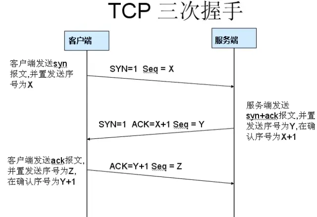
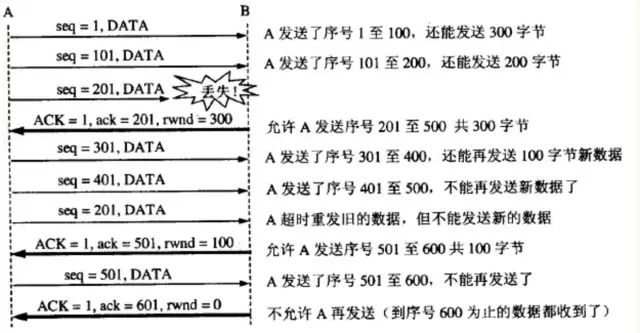
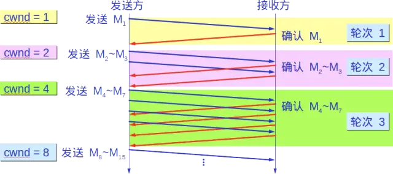
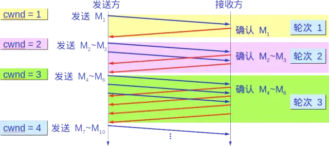
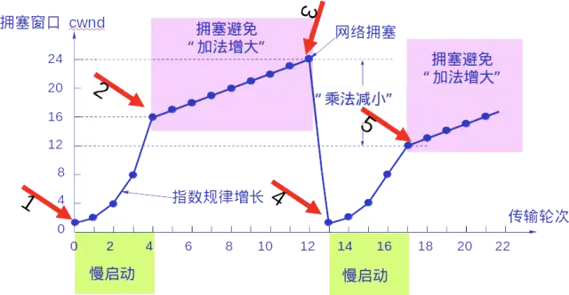
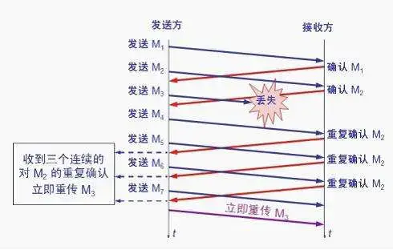

# TCP

[TCP 的那些事儿（上）](https://coolshell.cn/articles/11564.html)
[TCP 的那些事儿（下）](https://coolshell.cn/articles/11609.html)

TCP/IP（Transmission Control Protocol/Internet Protocol）即传输控制协议/网间协议，是一个工业标准的协议集，它是为广域网（WANs）设计的。
         UDP（User Data Protocol，用户数据报协议）是与TCP相对应的协议。它是属于TCP/IP协议族中的一种。

第一次握手：建立连接。客户端发送连接请求报文段，将SYN位置为1，Sequence Number为x；然后，客户端进入SYN_SEND状态，等待服务器的确认；

第二次握手：服务器收到SYN报文段。服务器收到客户端的SYN报文段，需要对这个SYN报文段进行确认，设置Acknowledgment Number为x+1(Sequence Number+1)；同时，自己自己还要发送SYN请求信息，将SYN位置为1，Sequence Number为y；服务器端将上述所有信息放到一个报文段（即SYN+ACK报文段）中，一并发送给客户端，此时服务器进入SYN_RECV状态； 
第三次握手：客户端收到服务器的SYN+ACK报文段。然后将Acknowledgment Number设置为y+1，向服务器发送ACK报文段，这个报文段发送完毕以后，客户端和服务器端都进入ESTABLISHED状态，完成TCP三次握手。
为什么要三次握手？

为了防止已失效的连接请求报文段突然又传送到了服务端，因而产生错误。

具体例子：“已失效的连接请求报文段”的产生在这样一种情况下：client发出的第一个连接请求报文段并没有丢失，而是在某个网络结点长时间的滞留了，以致延误到连接释放以后的某个时间才到达server。本来这是一个早已失效的报文段。但server收到此失效的连接请求报文段后，就误认为是client再次发出的一个新的连接请求。
于是就向client发出确认报文段，同意建立连接。假设不采用“三次握手”，那么只要server发出确认，新的连接就建立了。由于现在client并没有发出建立连接的请求，因此不会理睬server的确认，也不会向server发送数据。但server却以为新的运输连接已经建立，并一直等待client发来数据。这样，server的很多资源就白白浪费掉了。采用“三次握手”的办法可以防止上述现象发生。例如刚才那种情况，client不会向server的确认发出确认。server由于收不到确认，就知道client并没有要求建立连接。”

第一次分手：主机1（可以使客户端，也可以是服务器端），设置Sequence Number，向主机2发送一个FIN报文段；此时，主机1进入FIN_WAIT_1状态；这表示主机1没有数据要发送给主机2了；

第二次分手：主机2收到了主机1发送的FIN报文段，向主机1回一个ACK报文段，Acknowledgment Number为Sequence Number加1；主机1进入FIN_WAIT_2状态；主机2告诉主机1，我“同意”你的关闭请求；

第三次分手：主机2向主机1发送FIN报文段，请求关闭连接，同时主机2进入LAST_ACK状态；

第四次分手：主机1收到主机2发送的FIN报文段，向主机2发送ACK报文段，然后主机1进入TIME_WAIT状态；主机2收到主机1的ACK报文段以后，就关闭连接；此时，主机1等待2MSL后依然没有收到回复，则证明Server端已正常关闭，那好，主机1也可以关闭连接了。

为什么要四次分手？
TCP协议是一种面向连接的、可靠的、基于字节流的运输层通信协议。TCP是全双工模式，这就意味着，当主机1发出FIN报文段时，只是表示主机1已经没有数据要发送了，主机1告诉主机2，它的数据已经全部发送完毕了；但是，这个时候主机1还是可以接受来自主机2的数据；当主机2返回ACK报文段时，表示它已经知道主机1没有数据发送了，但是主机2还是可以发送数据到主机1的；当主机2也发送了FIN报文段时，这个时候就表示主机2也没有数据要发送了，就会告诉主机1，我也没有数据要发送了，之后彼此就会愉快的中断这次TCP连接。

为什么要等待2MSL？
MSL：报文段最大生存时间，它是任何报文段被丢弃前在网络内的最长时间。原因有二：

保证TCP协议的全双工连接能够可靠关闭

保证这次连接的重复数据段从网络中消失

第一点：如果主机1直接CLOSED了，那么由于IP协议的不可靠性或者是其它网络原因，导致主机2没有收到主机1最后回复的ACK。那么主机2就会在超时之后继续发送FIN，此时由于主机1已经CLOSED了，就找不到与重发的FIN对应的连接。所以，主机1不是直接进入CLOSED，而是要保持TIME_WAIT，当再次收到FIN的时候，能够保证对方收到ACK，最后正确的关闭连接。

第二点：如果主机1直接CLOSED，然后又再向主机2发起一个新连接，我们不能保证这个新连接与刚关闭的连接的端口号是不同的。也就是说有可能新连接和老连接的端口号是相同的。一般来说不会发生什么问题，但是还是有特殊情况出现：假设新连接和已经关闭的老连接端口号是一样的，如果前一次连接的某些数据仍然滞留在网络中，这些延迟数据在建立新连接之后才到达主机2，由于新连接和老连接的端口号是一样的，TCP协议就认为那个延迟的数据是属于新连接的，这样就和真正的新连接的数据包发生混淆了。所以TCP连接还要在TIME_WAIT状态等待2倍MSL，这样可以保证本次连接的所有数据都从网络中消失。

## 流量控制

如果发送方把数据发送得过快，接收方可能会来不及接收，这就会造成数据的丢失。所谓流量控制就是让发送方的发送速率不要太快，要让接收方来得及接收。

利用`滑动窗口机制`可以很方便地在TCP连接上实现对发送方的流量控制。

设A向B发送数据。在连接建立时，B告诉了A：“我的接收窗口是 rwnd = 400 ”(这里的 rwnd 表示 receiver window) 。因此，发送方的发送窗口不能超过接收方给出的接收窗口的数值。请注意，TCP的窗口单位是字节，不是报文段。假设每一个报文段为100字节长，而数据报文段序号的初始值设为1。大写ACK表示首部中的确认位ACK，小写ack表示确认字段的值ack。

从图中可以看出，B进行了三次流量控制。第一次把窗口减少到 rwnd = 300 ，第二次又减到了 rwnd = 100 ，最后减到 rwnd = 0 ，即不允许发送方再发送数据了。这种使发送方暂停发送的状态将持续到主机B重新发出一个新的窗口值为止。B向A发送的三个报文段都设置了 ACK = 1 ，只有在ACK=1时确认号字段才有意义。

TCP为每一个连接设有一个持续计时器(persistence timer)。只要TCP连接的一方收到对方的零窗口通知，就启动持续计时器。若持续计时器设置的时间到期，就发送一个零窗口控测报文段（携1字节的数据），那么收到这个报文段的一方就重新设置持续计时器。

## TCP拥塞控制

### 慢启动
发送方维持一个拥塞窗口 cwnd ( congestion window )的状态变量。拥塞窗口的大小取决于网络的拥塞程度，并且动态地在变化。发送方让自己的发送窗口等于拥塞窗口。

发送方控制拥塞窗口的原则是：只要网络没有出现拥塞，拥塞窗口就再增大一些，以便把更多的分组发送出去。但只要网络出现拥塞，拥塞窗口就减小一些，以减少注入到网络中的分组数。

慢开始算法：

当主机开始发送数据时，如果立即所大量数据字节注入到网络，那么就有可能引起网络拥塞，因为现在并不清楚网络的负荷情况。因此，较好的方法是 先探测一下，即由小到大逐渐增大发送窗口，也就是说，由小到大逐渐增大拥塞窗口数值。

通常在刚刚开始发送报文段时，先把拥塞窗口 cwnd 设置为一个最大报文段MSS的数值。而在每收到一个对新的报文段的确认后，把拥塞窗口增加至多一个MSS的数值。用这样的方法逐步增大发送方的拥塞窗口 cwnd ，可以使分组注入到网络的速率更加合理。

每经过一个传输轮次，拥塞窗口 cwnd 就加倍。一个传输轮次所经历的时间其实就是往返时间`RTT`。不过“传输轮次”更加强调：把拥塞窗口cwnd所允许发送的报文段都连续发送出去，并收到了对已发送的最后一个字节的确认。

另，慢开始的“慢”并不是指cwnd的增长速率慢，而是指在TCP开始发送报文段时先设置cwnd=1，使得发送方在开始时只发送一个报文段（目的是试探一下网络的拥塞情况），然后再逐渐增大cwnd。

为了防止拥塞窗口cwnd增长过大引起网络拥塞，还需要设置一个慢开始门限ssthresh状态变量。慢开始门限ssthresh的用法如下：

* 当 cwnd < ssthresh 时，使用上述的慢开始算法。
* 当 cwnd > ssthresh 时，停止使用慢开始算法而改用拥塞避免算法。
* 当 cwnd = ssthresh 时，既可使用慢开始算法，也可使用拥塞控制避免算法。拥塞避免

### 拥塞避免

让拥塞窗口cwnd缓慢地增大，即每经过一个往返时间RTT就把发送方的拥塞窗口cwnd加1，而不是加倍。这样拥塞窗口cwnd按线性规律缓慢增长，比慢开始算法的拥塞窗口增长速率缓慢得多。

无论在慢开始阶段还是在拥塞避免阶段，只要发送方判断网络出现拥塞（其根据就是没有收到确认），就要把慢开始门限ssthresh设置为出现拥塞时的发送 方窗口值的一半（但不能小于2）。然后把拥塞窗口cwnd重新设置为1，执行慢开始算法。

这样做的目的就是要迅速减少主机发送到网络中的分组数，使得发生 拥塞的路由器有足够时间把队列中积压的分组处理完毕。

如下图，用具体数值说明了上述拥塞控制的过程。现在发送窗口的大小和拥塞窗口一样大。

## 快重传和快恢复

### 快重传

快重传算法首先要求接收方每收到一个失序的报文段后就立即发出重复确认（为的是使发送方及早知道有报文段没有到达对方）而不要等到自己发送数据时才进行捎带确认。

接收方收到了M1和M2后都分别发出了确认。现在假定接收方没有收到M3但接着收到了M4。

显然，接收方不能确认M4，因为M4是收到的失序报文段。根据 可靠传输原理，接收方可以什么都不做，也可以在适当时机发送一次对M2的确认。

但按照快重传算法的规定，接收方应及时发送对M2的重复确认，这样做可以让 发送方及早知道报文段M3没有到达接收方。发送方接着发送了M5和M6。接收方收到这两个报文后，也还要再次发出对M2的重复确认。这样，发送方共收到了 接收方的四个对M2的确认，其中后三个都是重复确认。

快重传算法还规定，发送方只要一连收到三个重复确认就应当立即重传对方尚未收到的报文段M3，而不必 继续等待M3设置的重传计时器到期。

由于发送方尽早重传未被确认的报文段，因此采用快重传后可以使整个网络吞吐量提高约20%。

`TCP`是需要顺序接收的，如果丢包，需要等待重传。在没有`快重传`的时候需要等到`M3设置的重传计时器`到期，这时还没收到`确认`就重传。使用了`快重传`之后，`接收方`第一时间反馈需要重传，这比`重传计时器`快，所有提升了吞吐量。一般接受方会设置一定的缓存（`待确认的观点，记不了`），后面接收到的`M4`和`M5`是可以缓存下来，等`M3`重传了之后使用的。

### 快恢复

与快重传配合使用的还有快恢复算法，其过程有以下两个要点：
1. 当发送方连续收到三个重复确认，就执行“乘法减小”算法，把慢开始门限ssthresh减半。
2. 与慢开始不同之处是现在不执行慢开始算法（即拥塞窗口cwnd现在不设置为1），而是把cwnd值设置为 慢开始门限ssthresh减半后的数值，然后开始执行拥塞避免算法（“加法增大”），使拥塞窗口缓慢地线性增大。