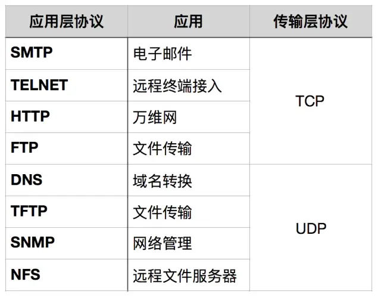

# TCP和UDP区别

TCP是面向有连接型，UDP是面向无连接型；
TCP是一对一传输，UDP支持一对一、一对多、多对一和多对多的交互通信；
TCP是面向字节流的，即把应用层传来的报文看成字节流，将字节流拆分成大小不等的数据块，并添加TCP首部；UDP是面向报文的，对应用层传下来的报文不拆分也不合并，仅添加UDP首部；
TCP支持传输可靠性的多种措施，包括保证包的传输顺序、重发机制、流量控制和拥塞控制；UDP仅提供最基本的数据传输能力。

### 面向报文

面向报文的传输方式是应用层交给UDP多长的报文，UDP就照样发送，即一次发送一个报文。因此，应用程序必须选择合适大小的报文。若报文太长，则IP层需要分片，降低效率。若太短，会是IP太小。

### 面向字节流

面向字节流的话，虽然应用程序和TCP的交互是一次一个数据块（大小不等），但TCP把应用程序看成是一连串的无结构的字节流。TCP有一个缓冲，当应用程序传送的数据块太长，TCP就可以把它划分短一些再传送。

