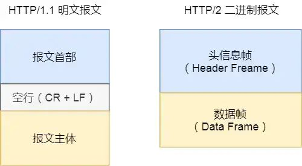
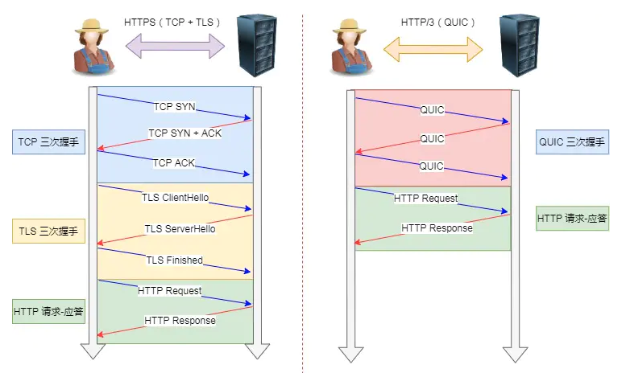

# HTTP

[HTTP](https://mp.weixin.qq.com/s/dESEl1qYKPMYqNVOWYfUDA)

## HTTP协议无状态

无状态是指协议对于事务处理没有记忆能力，服务器不知道客户端是什么状态。即我们给服务器发送 HTTP 请求之后，服务器根据请求，会给我们发送数据过来，但是，发送完，不会记录任何信息。

HTTP 是一个无状态协议，这意味着每个请求都是独立的，Keep-Alive 没能改变这个结果。缺少状态意味着如果后续处理需要前面的信息，则它必须重传，这样可能导致每次连接传送的数据量增大。另一方面，在服务器不需要先前信息时它的应答就较快。HTTP 协议这种特性有优点也有缺点，优点在于解放了服务器，每一次请求 “点到为止” 不会造成不必要连接占用，缺点在于每次请求会传输大量重复的内容信息。

客户端与服务器进行动态交互的 Web 应用程序出现之后，HTTP 无状态的特性严重阻碍了这些应用程序的实现，毕竟交互是需要承前启后的，简单的购物车程序也要知道用户到底在之前选择了什么商品。于是，两种用于保持 HTTP 连接状态的技术就应运而生了，一个是 Cookie，而另一个则是 Session。

## HTTP 超文本传输协议

HTTP 是超文本传输协议，也就是HyperText Transfer Protocol。它可以拆成三个部分：

* 超文本
* 传输
* 协议

## 超文本
HTTP 传输的内容是「超文本」 我们先来理解「文本」，在互联网早期的时候只是简单的字符文字，但现在「文本」的涵义已经可以扩展为图片、视频、压缩包等，在 HTTP 眼里这些都算做「文本」。再来理解「超文本」，它就是超越了普通文本的文本，它是`文字`、`图片`、`视频`等的混合体**最关键有超链接，能从一个超文本跳转到另外一个超文本**。`HTML 就是最常见的超文本了，它本身只是纯文字文件，但内部用很多标签定义了图片、视频等的链接，在经过浏览器的解释，呈现给我们的就是一个文字、有画面的网页了`。OK，经过了对 HTTP 里这三个名词的详细解释，就可以给出比「超文本传输协议」这七个字更准确更有技术含量的答案：HTTP 是一个在计算机世界里专门在「两点」之间「传输」文字、图片、音频、视频等「超文本」数据的「约定和规范」 ⚠️注意: HTTP 不是用于从互联网服务器传输超文本到本地浏览器的协议，也可以是服务器到服务器，所以采用两点之间的描述会更准确

## HTTP 的特点？HTTP 有哪些缺点？

### HTTP 的特点概括
灵活可扩展 主要体现在两个方面。
一个是语义上的自由，只规定了基本格式，比如空格分隔单词，换行分隔字段，其他的各个部分都没有严格的语法限制
另一个是传输形式的多样性，不仅仅可以传输文本，还能传输图片、视频等任意数据，非常方便。
可靠传输 HTTP 基于 TCP/IP，因此把这一特性继承了下来。这属于 TCP 的特性，不具体介绍了。
请求-应答 也就是一发一收、有来有回， 当然这个请求方和应答方不单单指客户端和服务器之间，如果某台服务器作为代理来连接后端的服务端，那么这台服务器也会扮演请求方的角色。
无状态 这里的状态是指通信过程的上下文信息，而每次 http 请求都是独立、无关的，默认不需要保留状态信息
### HTTP 缺点
无状态 所谓的优点和缺点还是要分场景来看的，对于 HTTP 而言，最具争议的地方在于它的无状态。
在需要长连接的场景中，需要保存大量的上下文信息，以免传输大量重复的信息，那么这时候无状态就是 http 的缺点了。
但与此同时，另外一些应用仅仅只是为了获取一些数据，不需要保存连接上下文信息，无状态反而减少了网络开销，成为了 http 的优点。
明文传输 即协议里的报文(主要指的是头部)不使用二进制数据，而是文本形式。这当然对于调试提供了便利，但同时也让 HTTP 的报文信息暴露给了外界，给攻击者也提供了便利。WIFI陷阱就是利用 HTTP 明文传输的缺点，诱导你连上热点，然后疯狂抓你所有的流量，从而拿到你的敏感信息。
队头阻塞问题 当 http 开启长连接时，共用一个 TCP 连接，同一时刻只能处理一个请求，那么当前请求耗时过长的情况下，其它的请求只能处于阻塞状态，也就是著名的队头阻塞问题。接下来会有一小节讨论这个问题。
### HTTP 报文结构是怎样的？

对于 TCP 而言，在传输的时候分为两个部分: **TCP头 **和 数据部分。而 HTTP 类似，也是 header + body 的结构，具体而言:
```
起始行 + 头部 + 空行 + 实体
```
由于 http 请求报文和响应报文是有一定区别，因此我们分开介绍

#### 起始行
对于请求报文来说，起始行类似下面这样:
```js
GET /home HTTP/1.1
```
也就是**方法 + 路径 + http**版本。对于响应报文来说，起始行一般张这个样:
```js
HTTP/1.1 200 OK
```
响应报文的起始行也叫做状态行。由 **http版本、状态码和原因 三部分组成**。⚠️注意：在起始行中，每两个部分之间用空格隔开，最后一个部分后面应该接一个换行，严格遵循 ABNF 语法规范

#### 头部
展示一下请求头和响应头在报文中的位置:


不管是请求头还是响应头，其中的字段是相当多的，而且牵扯到http非常多的特性，这里就不一一列举的，重点看看这些头部字段的格式：

* 字段名不区分大小写
* 字段名不允许出现空格，不可以出现下划线_
* 字段名后面必须**紧接着**:
#### 空行
很重要，用来区分开头部和实体。问: 如果说在头部中间故意加一个空行会怎么样？那么空行后的内容全部被视为实体。

#### 实体
就是具体的数据了，也就是 body 部分。请求报文对应请求体, 响应报文对应响应体

#### 如何理解 HTTP 的请求方法？

http/1.1 规定了以下请求方法(注意，都是大写):

* GET 通常用来获取资源
* HEAD 获取资源的元信息
* POST 提交数据，即上传数据
* PUT 修改数据
* DELETE 删除资源(几乎用不到)
* CONNECT 建立连接隧道，用于代理服务器
* OPTIONS 列出可对资源实行的请求方法，预检请求，用来跨域请求
* TRACE 追踪请求-响应的传输路径

#### GET 与 POST

说一下 GET 和 POST 的区别？
首先最直观的是语义上的区别。而后又有这样一些具体的差别:

从缓存的角度 GET 请求会被浏览器主动缓存下来，留下历史记录，而 POST 默认不会。
从编码的角度 GET 只能进行 URL 编码，只能接收 ASCII 字符，而 POST 没有限制。
从参数的角度 GET 一般放在 URL 中，因此不安全，POST 放在请求体中，更适合传输敏感信息。
从幂等性的角度 GET是幂等的，而POST不是。(幂等表示执行相同的操作，结果也是相同的)
从TCP的角度 GET 请求会把请求报文一次性发出去，而 POST 会分为两个 TCP 数据包，首先发 header 部分(预检请求)，如果服务器响应 100(continue)， 然后发 body 部分。(火狐浏览器除外，它的 POST 请求只发一个 TCP 包)

#### GET 和 POST 方法都是安全和幂等的吗？
先说明下安全和幂等的概念：

在 HTTP 协议里，所谓的「安全」是指请求方法不会「破坏」服务器上的资源。
所谓的「幂等」，意思是多次执行相同的操作，结果都是「相同」的。
那么很明显 GET 方法就是安全且幂等的，因为它是「只读」操作，无论操作多少次，服务器上的数据都是安全的，且每次的结果都是相同的。POST 因为是「新增或提交数据」的操作，会修改服务器上的资源，所以是不安全的，且多次提交数据就会创建多个资源，所以不是幂等的。

#### HTTP 常见的状态码，有哪些？

查看更加详细请点击 了解常见HTTP状态码


1xx 类状态码属于提示信息，是协议处理中的一种中间状态，实际用到的比较少

200 OK 是最常见的成功状态码，表示一切正常。如果是非 HEAD 请求，服务器返回的响应头都会有 body 数据。

204 No Content 也是常见的成功状态码，与 200 OK 基本相同，但响应头没有 body 数据

206 Partial Content 是应用于 HTTP 分块下载或断电续传，表示响应返回的 body 数据并不是资源的全部，而是其中的一部分，也是服务器处理成功的状态。

301 Moved Permanently 表示永久重定向，说明请求的资源已经不存在了，需改用新的 URL 再次访问。

302 Found 表示临时重定向，说明请求的资源还在，但暂时需要用另一个 URL 来访问 301 和 302 都会在响应头里使用字段 Location，指明后续要跳转的 URL，浏览器会自动重定向新的 URL。

304 Not Modified 不具有跳转的含义，表示资源未修改，重定向已存在的缓冲文件，也称缓存重定向，用于缓存控制。

400 Bad Request 表示客户端请求的报文有错误，但只是个笼统的错误。

403 Forbidden 表示服务器禁止访问资源，并不是客户端的请求出错。

404 Not Found 表示请求的资源在服务器上不存在或未找到，所以无法提供给客户端。

500 Internal Server Error 与 400 类型，是个笼统通用的错误码，服务器发生了什么错误，我们并不知道

501 Not Implemented 表示客户端请求的功能还不支持，类似“即将开业，敬请期待”的意思

502 Bad Gateway 通常是服务器作为网关或代理时返回的错误码，表示服务器自身工作正常，访问后端服务器发生了错误。

503 Service Unavailable 表示服务器当前很忙，暂时无法响应服务器，类似“网络服务正忙，请稍后重试”的意思。

#### http 常见字段有哪些？


##### 请求头

###### Host

客户端发送请求时，用来指定服务器的域名图片
```
Host: www.A.com
```
有了 `Host` 字段，就可以将请求发往同一台服务器上的不同网站

###### Connection
Connection 字段最常用于客户端要求服务器使用 TCP 持久连接，以便其他请求复用 图片 HTTP/1.1 版本的默认连接都是持久连接，但为了兼容老版本的 HTTP，需要指定 Connection 首部字段的值为 Keep-Alive
```
Connection: keep-alive
```
一个可以复用的 TCP 连接就建立了，直到客户端或服务器主动关闭连接。但是，这不是标准字段。

###### Accept-Encoding

请求时用 Accept-Encoding 字段说明自己可以接受哪些压缩方法，请求返回的 `Content-Encoding` 表明数据使用了什么压缩方式
```
Accept-Encoding: gzip, deflate
```
###### Accept

使用 Accept 字段声明自己可以接受哪些数据格式。
```
Accept: application/json, text/plain, */*
```

###### Transfer-Encoding

`Transfer-Encoding`: 表示分块传输数据，设置这个字段后会自动产生两个效果:

* `Content-Length 字段会被忽略`
* `基于长连接持续推送动态内容`
```
Transfer-Encoding: chunked
```

##### 响应头

###### Content-Length

服务器在返回数据时，会有 Content-Length 字段，表明本次回应的数据长度。图片
```
Content-Length: 1000
```
如上面则是告诉浏览器，本次服务器回应的数据长度是 1000 个字节，后面的字节就属于下一个回应了。
###### Content-Encoding

Content-Encoding 字段说明数据的压缩方法。表示服务器返回的数据使用了什么压缩格式图片
```
Content-Encoding: gzip
```
上面表示服务器返回的数据采用了 gzip 方式压缩，告知客户端需要用此方式解压 客户端在请求时，用 Accept-Encoding 字段说明自己可以接受哪些压缩方法
```
Accept-Encoding: gzip, deflate
```

###### Content-Type
Content-Type 字段用于服务器回应时，告诉客户端，本次数据是什么格式图片
```
Content-Type: text/html; charset=utf-8
```
上面的类型表明，发送的是网页，而且编码是UTF-8。客户端请求的时候，可以使用 Accept 字段声明自己可以接受哪些数据格式。
```
Accept: */*
```
上面代码中，客户端声明自己可以接受任何格式的数据

###### Accept-Ranges

```
// none表示不支持范围请求
Accept-Ranges: none

Accept-Ranges: bytes 表示界定范围的单位是 bytes 。这里 Content-Length也是有效信息，因为它提供了要检索的图片的完整大小
```

### Accept 系列字段了解多少

对于 `Accept` 系列字段的介绍分为四个部分:`数据格式`、`压缩方式`、`支持语言`和`字符集`

#### 数据格式

HTTP 支持非常多的数据格式，那么这么多格式的数据一起到达客户端，客户端怎么知道它的格式呢？当然，最低效的方式是直接猜，有没有更好的方式呢？直接指定可以吗？答案是肯定的 不过首先需要介绍一个标准 —— MIME(Multipurpose Internet Mail Extensions, 多用途互联网邮件扩展) 它首先用在电子邮件系统中，让邮件可以发任意类型的数据，这对于 HTTP 来说也是通用的。因此，HTTP 从 **MIME type **取了一部分来标记报文 body 部分的数据类型，这些类型体现在Content-Type这个字段，当然这是针对于发送端而言，接收端想要收到特定类型的数据，也可以用Accept字段。具体而言，这两个字段的取值可以分为下面几类:

text text/html, text/plain, text/css 等
image image/gif, image/jpeg, image/png 等
audio/video audio/mpeg, video/mp4 等
application application/json, application/javascript, application/pdf, application/octet-stream
#### 压缩方式

当然一般这些数据都是会进行编码压缩的，采取什么样的压缩方式就体现在了发送方的 Content-Encoding 字段上， 同样的，接收什么样的压缩方式体现在了接受方的Accept-Encoding字段上。这个字段的取值有下面几种：

* gzip 当今最流行的压缩格式
* deflate 另外一种著名的压缩格式
* br 一种专门为 HTTP 发明的压缩算法
```
// 发送端
Content-Encoding: gzip

// 接收端
Accept-Encoding: gzip
```
#### 支持语言

对于发送方而言，还有一个Content-Language字段，在需要实现国际化的方案当中，可以用来指定支持的语言，在接受方对应的字段为Accept-Language。如:
```
// 发送端
Accept-Language: zh-CN, zh, en

// 接收端
Content-Language: zh-CN, zh, en
```

##### 字符集

最后是一个比较特殊的字段, 在接收端对应为Accept-Charset，指定可以接受的字符集，而在发送端并没有对应的Content-Charset, 而是直接放在了Content-Type中，以charset属性指定。如:
```
// 发送端
Content-Type: text/html; charset=utf-8

// 接收端
Accept-Charset: charset=utf-8
```


## 对于定长和不定长的数据，HTTP 是怎么传输的？

### 定长包体
对于定长包体而言，发送端在传输的时候一般会带上 Content-Length, 来指明包体的长度。我们用一个nodejs服务器来模拟一下:

const http = require('http');

const server = http.createServer();

server.on('request', (req, res) => {
  if(req.url === '/') {
    res.setHeader('Content-Type', 'text/plain');
    res.setHeader('Content-Length', 10);
    res.write("helloworld");
  }
})

server.listen(8081, () => {
  console.log("成功启动");
})
复制代码
启动后访问: localhost:8081。浏览器中显示如下:

helloworld
复制代码
这是长度正确的情况，那不正确的情况是如何处理的呢？我们试着把这个长度设置的小一些:

res.setHeader('Content-Length', 8);
复制代码
重启服务，再次访问，现在浏览器中内容如下:

hellowor
复制代码
那后面的ld哪里去了呢？实际上在 http 的响应体中直接被截去了。然后我们试着将这个长度设置得大一些:

res.setHeader('Content-Length', 12);
复制代码
此时浏览器显示如下: 图片 直接无法显示了。可以看到 Content-Length 对于 http 传输过程起到了十分关键的作用，如果设置不当可以直接导致传输失败。

### 不定长包体
上述是针对于定长包体，那么对于不定长包体而言是如何传输的呢？这里就必须介绍另外一个 http 头部字段了:

Transfer-Encoding: chunked

// Transfer-Encoding: chunked
// Transfer-Encoding: compress
// Transfer-Encoding: deflate
// Transfer-Encoding: gzip
// Transfer-Encoding: identity
// Several values can be listed, separated by a comma
// Transfer-Encoding: gzip, chunked
复制代码
表示分块传输数据，设置这个字段后会自动产生两个效果:

* `Content-Length 字段会被忽略`
* `基于长连接持续推送动态内容`
我们依然以一个实际的例子来模拟分块传输，nodejs 程序如下:

const http = require('http');

const server = http.createServer();

server.on('request', (req, res) => {
  if(req.url === '/') {
    res.setHeader('Content-Type', 'text/html; charset=utf8');
    res.setHeader('Content-Length', 10);
    res.setHeader('Transfer-Encoding', 'chunked');
    res.write("<p>来啦</p>");
    setTimeout(() => {
      res.write("第一次传输<br/>");
    }, 1000);
    setTimeout(() => {
      res.write("第二次传输");
      res.end()
    }, 2000);
  }
})

server.listen(8009, () => {
  console.log("成功启动");
})
复制代码
图片 用 telnet 抓到的响应如下: 图片 注意，Connection: keep-alive 及之前的为响应行和响应头，后面的内容为响应体，这两部分用换行符隔开。响应体的结构比较有意思，如下所示:

chunk长度(16进制的数)
第一个chunk的内容
chunk长度(16进制的数)
第二个chunk的内容
......
0

复制代码
最后是留有有一个空行的，这一点请大家注意。以上便是 http 对于定长数据和不定长数据的传输方式。

### HTTP 如何处理大文件的传输？

对于几百 M 甚至上 G 的大文件来说，如果要一口气全部传输过来显然是不现实的，会有大量的等待时间，严重影响用户体验。因此，HTTP 针对这一场景，采取了范围请求的解决方案，允许客户端仅仅请求一个资源的一部分。

如何支持
当然，前提是服务器要支持范围请求，要支持这个功能，就必须加上这样一个响应头:

$ curl -I https://www.yuque.com/
HTTP/1.1 200 OK
...
Accept-Ranges: bytes
Content-Length: 146515


$ curl -I http://download.dcloud.net.cn/HBuilder.9.0.2.macosx_64.dmg
$ curl -H  "Range: bytes=0-10" http://download.dcloud.net.cn/HBuilder.9.0.2.macosx_64.dmg -v

//省略
HTTP/1.1 200 OK
...
Accept-Ranges: none

//详细的
HTTP/1.1 200 OK
Server: Tengine
Content-Type: application/octet-stream
Content-Length: 233295878
Connection: keep-alive
Date: Mon, 26 Apr 2021 13:12:46 GMT
x-oss-request-id: 6086BC4E66D721363972F4A8
x-oss-cdn-auth: success
Accept-Ranges: bytes
ETag: "6D932737FD8C6058D6AE93BCC4C74AA7-45"
Last-Modified: Tue, 06 Mar 2018 13:20:31 GMT
x-oss-object-type: Multipart
x-oss-hash-crc64ecma: 7369427768111114923
x-oss-storage-class: Standard
x-oss-server-time: 156
Ali-Swift-Global-Savetime: 1617704046
Via: cache15.l2cn1809[0,200-0,H], cache2.l2cn1809[1,0], cache7.cn682[39,39,200-0,M], cache2.cn682[44,0]
Age: 778
X-Cache: MISS TCP_MISS dirn:-2:-2
X-Swift-SaveTime: Mon, 26 Apr 2021 13:25:44 GMT
X-Swift-CacheTime: 3600
Timing-Allow-Origin: *
EagleId: af062a4216194435440612604e
复制代码
假如在响应中存在Accept-Ranges首部（并且它的值不为 “none”），那么表示该服务器支持范围请求 在上面的响应中，Accept-Ranges: bytes 表示界定范围的单位是 bytes 。这里 Content-Length也是有效信息，因为它提供了要检索的图片的完整大小

如果站点未发送Accept-Ranges首部，那么它们有可能不支持范围请求。一些站点会明确将其值设置为 "none"，以此来表明不支持。在这种情况下，某些应用的下载管理器会将暂停按钮禁用。

curl -I https://www.youtube.com/watch?v=EwTZ2xpQwpA

HTTP/1.1 200 OK
...
Accept-Ranges: none
复制代码

### Range 字段拆解
而对于客户端而言，它需要指定请求哪一部分，通过 Range 这个请求头字段确定，格式为bytes=x-y。接下来就来讨论一下这个 Range 的书写格式:

**0-499 表示从开始到第 499 个字节。**
**500- 表示从第 500 字节到文件终点。**
**-100 表示文件的最后100个字节。**
服务器收到请求之后，首先验证范围是否合法，如果越界了那么返回`416错误码`，否则读取相应片段，返回`206状态码`。同时，服务器需要添加 `Content-Range` 字段，这个字段的格式根据请求头中`Range`字段的不同而有所差异。具体来说，请求单段数据和请求多段数据，响应头是不一样的。举个例子:
```
// 单段数据
curl http://i.imgur.com/z4d4kWk.jpg -i -H "Range: bytes=0-1023"
Range: bytes=0-9

// 多段数据
curl http://www.example.com -i -H "Range: bytes=0-50, 100-150"
Range: bytes=0-9, 30-39
```
接下来我们就分别来讨论着两种情况

#### 单段数据

对于单段数据的请求，返回的响应如下:
```
HTTP/1.1 206 Partial Content
Content-Length: 10
Accept-Ranges: bytes
Content-Range: bytes 0-9/100

i am xxxxx
```
值得注意的是Content-Range字段，0-9表示请求的返回，100表示资源的总大小，很好理解。

#### 多段数据
接下来我们看看多段请求的情况。得到的响应会是下面这个形式:
```
HTTP/1.1 206 Partial Content
Content-Type: multipart/byteranges; boundary=00000010101
Content-Length: 189
Connection: keep-alive
Accept-Ranges: bytes


--00000010101
Content-Type: text/plain
Content-Range: bytes 0-9/96

i am xxxxx
--00000010101
Content-Type: text/plain
Content-Range: bytes 20-29/96

eex jspy e
--00000010101--
```
这个时候出现了一个非常关键的字段`Content-Type: multipart/byteranges;boundary=00000010101`，它代表了信息量是这样的:

* 请求一定是多段数据请求
* 响应体中的分隔符是 00000010101
因此，在响应体中各段数据之间会由这里指定的分隔符分开，而且在最后的分隔末尾添上--表示结束。以上就是 http 针对大文件传输所采用的手段。

#### HTTP 中如何处理表单数据的提交？

在 http 中，有两种主要的表单提交的方式，体现在两种不同的Content-Type取值:

* application/x-www-form-urlencoded
* multipart/form-data
由于表单提交一般是POST请求，很少考虑GET，因此这里我们将默认提交的数据放在请求体中

##### application/x-www-form-urlencoded
对于application/x-www-form-urlencoded格式的表单内容，有以下特点:

其中的数据会被编码成以&分隔的键值对
字符以URL编码方式编码。如：
// 转换过程: {a: 1, b: 2} -> a=1&b=2 -> 如下(最终形式)
"a%3D1%26b%3D2"
复制代码
multipart/form-data
##### 对于multipart/form-data而言:

请求头中的Content-Type字段会包含boundary，且boundary的值有浏览器默认指定。例:
Content-Type: multipart/form-data;boundary=----WebkitFormBoundaryRRJKeWfHPGrS4LKe
复制代码
数据会分为多个部分，每两个部分之间通过分隔符来分隔，每部分表述均有 HTTP 头部描述子包体，如Content-Type，在最后的分隔符会加上--表示结束。
相应的请求体是下面这样:

Content-Disposition: form-data;name="data1";
Content-Type: text/plain
data1
----WebkitFormBoundaryRRJKeWfHPGrS4LKe
Content-Disposition: form-data;name="data2";
Content-Type: text/plain
data2
----WebkitFormBoundaryRRJKeWfHPGrS4LKe--
复制代码
值得一提的是，multipart/form-data 格式最大的特点在于:每一个表单元素都是独立的资源表述。另外，你可能在写业务的过程中，并没有注意到其中还有boundary的存在，如果你打开抓包工具，确实可以看到不同的表单元素被拆分开了，之所以在平时感觉不到，是以为浏览器和 HTTP 给你封装了这一系列操作。而且，在实际的场景中，对于图片等文件的上传，基本采用multipart/form-data而不用application/x-www-form-urlencoded，因为没有必要做 URL 编码，带来巨大耗时的同时也占用了更多的空间。

## 如何理解 HTTP 代理？

我们知道在 HTTP 是基于请求-响应模型的协议，一般由客户端发请求，服务器来进行响应。当然，也有特殊情况，就是代理服务器的情况。引入代理之后，作为代理的服务器相当于一个中间人的角色，对于客户端而言，表现为服务器进行响应；而对于源服务器，表现为客户端发起请求，具有双重身份。那代理服务器到底是用来做什么的呢？

### 功能

* 负载均衡 客户端的请求只会先到达代理服务器，后面到底有多少源服务器，IP 都是多少，客户端是不知道的。因此，这个代理服务器可以拿到这个请求之后，可以通过特定的算法分发给不同的源服务器，让各台源服务器的负载尽量平均。当然，这样的算法有很多，包括**随机算法、轮询、一致性hash、LRU(最近最少使用)**等等，不过这些算法并不是本文的重点，大家有兴趣自己可以研究一下。
* 保障安全 利用心跳机制监控后台的服务器，一旦发现故障机就将其踢出集群。并且对于上下行的数据进行过滤，对非法 IP 限流，这些都是代理服务器的工作。
* 缓存代理 将内容缓存到代理服务器，使得客户端可以直接从代理服务器获得而不用到源服务器那里

### 相关头部字段

#### Via

代理服务器需要标明自己的身份，在 HTTP 传输中留下自己的痕迹，怎么办呢？通过Via字段来记录。举个例子，现在中间有两台代理服务器，在客户端发送请求后会经历这样一个过程:

客户端 -> 代理1 -> 代理2 -> 源服务器
复制代码
在源服务器收到请求后，会在请求头拿到这个字段:

Via: proxy_server1, proxy_server2
复制代码
而源服务器响应时，最终在客户端会拿到这样的响应头:

Via: proxy_server2, proxy_server1
复制代码
可以看到，Via中代理的顺序即为在 HTTP 传输中报文传达的顺序

#### X-Forwarded-For

字面意思就是为谁转发, 它记录的是请求方的IP地址(注意，和Via区分开，X-Forwarded-For记录的是请求方这一个IP)。

##### X-Real-IP

是一种获取用户真实 IP 的字段，不管中间经过多少代理，这个字段始终记录最初的客户端的IP。相应的，还有`X-Forwarded-Host`和`X-Forwarded-Proto`，分别记录**客户端(注意哦，不包括代理)的域名和协议名**。

##### X-Forwarded-For产生的问题
前面可以看到，X-Forwarded-For这个字段记录的是请求方的 IP，这意味着每经过一个不同的代理，这个字段的名字都要变，从客户端到代理1，这个字段是客户端的 IP，从代理1到代理2，这个字段就变为了代理1的 IP。但是这会产生两个问题:

* 意味着代理必须解析 HTTP 请求头，然后修改，比直接转发数据性能下降。
* 在 HTTPS 通信加密的过程中，原始报文是不允许修改的。
由此产生了代理协议，一般使用明文版本，只需要在 HTTP 请求行上面加上这样格式的文本即可:

// PROXY + TCP4/TCP6 + 请求方地址 + 接收方地址 + 请求端口 + 接收端口
PROXY TCP4 0.0.0.1 0.0.0.2 1111 2222
GET / HTTP/1.1
复制代码
这样就可以解决X-Forwarded-For带来的问题了

## HTTP1.1

### HTTP1.1 的优点有哪些，怎么体现的？
HTTP 最凸出的优点是「简单、灵活和易于扩展、应用广泛和跨平台」

#### 简单
HTTP 基本的报文格式就是 header + body，头部信息也是 key-value 简单文本的形式，易于理解，降低了学习和使用的门槛
#### 灵活和易于扩展
HTTP协议里的各类请求方法、URI/URL、状态码、头字段等每个组成要求都没有被固定死，都允许开发人员自定义和扩充
同时 HTTP 由于是工作在应用层（OSI 第七层），则它下层可以随意变化
**HTTPS 也就是在 HTTP 与 TCP 层之间增加了 SSL/TLS 安全传输层，HTTP/3 甚至把 TCP 层换成了基于 UDP 的 QUIC**
#### 应用广泛和跨平台
互联网发展至今，HTTP 的应用范围非常的广泛，从台式机的浏览器到手机上的各种 APP，从看新闻、刷贴吧到购物、理财、吃鸡，HTTP 的应用片地开花，同时天然具有跨平台的优越性

### 怎么理解SSL/TLS
TLS 和 SSL是其实是一个同种意思，知识叫法不同

* SSL 是"Secure Sockets Layer" 的缩写，中文叫做「安全套接层」。它是在上世纪 90 年代中期，由网景公司设计的。在 OSI 七层模型中处于会话层(第 5 层)
* TLS 是 "Transport Layer Security"，中文叫做 「传输层安全协议」。因为到了1999年，SSL 因为应用广泛，已经成为互联网上的事实标准。IETF 就在那年把 SSL 标准化。标准化之后的名称改为 TLS
**很多相关的文章都把这两者并列称呼(SSL/TLS)，因为这两者可以视作同一个东西的不同阶段。之前 SSL 出过三个大版本，当它发展到第三个大版本的时候才被标准化，成为 TLS，并被当做 TLS1.0 的版本，准确地说，TLS1.0 = SSL3.1**

### HTTP1.1 的的缺点呢？

HTTP 协议里有优缺点一体的双刃剑，分别是 `无状态`、`明文传输`，同时还有一大缺点`不安全`。

#### 无状态双刃剑

* 无状态的好处，因为服务器不会去记忆 HTTP 的状态，所以不需要额外的资源来记录状态信息，这能减轻服务器的负担，能够把更多的 CPU 和内存用来对外提供服务。
* 无状态的坏处，既然服务器没有记忆能力，它在完成有关联性的操作时会非常麻烦。
例如登录->添加购物车->下单->结算->支付，这系列操作都要知道用户的身份才行。但服务器不知道这些请求是有关联的，每次都要问一遍身份信息。
这样每操作一次，都要验证信息，这样的购物体验还能愉快吗？别问，问就是酸爽！
* 对于无状态的问题，解法方案有很多种，其中比较简单的方式用 Cookie 技术。
`Cookie` 通过在请求和响应报文中写入 Cookie 信息来控制客户端的状态。
相当于，在客户端第一次请求后，服务器会下发一个装有客户信息的「小贴纸」，后续客户端请求服务器的时候，带上「小贴纸」，服务器就能认得了了，

#### 明文传输双刃剑

* 明文意味着在传输过程中的信息，是可方便阅读的，通过浏览器的 `F12` 控制台或 `Wireshark` 抓包都可以直接肉眼查看，为我们调试工作带了极大的便利性。
* 但是这正是这样，HTTP 的所有信息都暴露在了光天化日下，相当于信息裸奔。在传输的漫长的过程中，信息的内容都毫无隐私可言，很容易就能被窃取，如果里面有你的账号密码信息，那你号没了

#### 不安全。HTTP 比较严重的缺点就是不安全：

* 通信使用明文（不加密），内容可能会被窃听。比如，账号信息容易泄漏，那你号没了
* 不验证通信方的身份，因此有可能遭遇伪装。比如，访问假的淘宝、拼多多，那你钱没了
* 无法证明报文的完整性，所以有可能已遭篡改。比如，网页上植入垃圾广告，视觉污染，眼没了

**HTTP 的安全问题，可以用 HTTPS 的方式解决，也就是通过引入 SSL/TLS 层，使得在安全上达到了极致。**

## 那你在说下 HTTP/1.1 的性能如何？
HTTP 协议是基于TCP/IP，并且使用了`「请求 - 应答」`的通信模式，所以性能的关键就在这两点里

### 长连接

早期 HTTP/1.0 性能上的一个很大的问题，那就是每发起一个请求，都要新建一次 TCP 连接（三次握手），而且是串行请求，做了无谓的 TCP 连接建立和断开，增加了通信开销。
* 为了解决上述 TCP 连接问题，HTTP/1.1 提出了长连接的通信方式，也叫**持久连接(Connection: keep-alive)。**这种方式的好处在于减少了 TCP 连接的重复建立和断开所造成的额外开销，减轻了服务器端的负载。
* 持久连接的特点是，只要任意一端没有明确提出断开连接，则保持 TCP 连接状态
* **并发连接** 对于一个域名允许分配多个长连接，那么相当于增加了任务队列，不至于一个队伍的任务阻塞其它所有任务。在RFC2616规定过客户端最多并发 2 个连接，不过事实上在现在的浏览器标准中，这个上限要多很多，`Chrome 中是 6 个`
* **域名分片** 一个域名不是可以并发 6 个长连接吗？那我就多分几个域名，比如 content1.sanyuan.com 、content2.sanyuan.com。这样一个sanyuan.com域名下可以分出非常多的`二级域名`，而它们都指向同样的一台服务器，能够并发的长连接数更多了，事实上也更好地解决了`队头阻塞`的问题

### 管道网络传输

* HTTP/1.1 采用了长连接的方式，这使得**管道（pipeline）网络传输**成为了可能。
* 即可在同一个 TCP 连接里面，客户端可以发起多个请求，只要第一个请求发出去了，不必等其回来，就可以发第二个请求出去，可以减少整体的响应时间。
举例来说，客户端需要请求两个资源。以前的做法是，在同一个TCP连接里面，先发送 A 请求，然后等待服务器做出回应，收到后再发出 B 请求。管道机制则是允许浏览器同时发出 A 请求和 B 请求

但是服务器还是按照顺序，先回应 A 请求，完成后再回应 B 请求。要是 前面的回应特别慢，后面就会有许多请求排队等着。这称为**队头堵塞**

### 队头阻塞

`「请求 - 应答」的模式加剧了 HTTP 的性能问题`
因为当顺序发送的请求序列中的一个请求因为某种原因被阻塞时，在后面排队的所有请求也一同被阻塞了，会招致客户端一直请求不到数据，这也就是`「队头阻塞」`。好比上班的路上塞车

* 总之 HTTP/1.1 的性能一般般，后续的 HTTP/2 和 HTTP/3 就是在优化 HTTP 的性能

## HTTP1.1、HTTP2、HTTP3 演变

### 说说 HTTP1.1 相比 HTTP1.0 提高了什么性能？

#### HTTP1.1 相比 HTTP1.0 性能上的改进：

* 使用 `TCP 长连接`的方式改善了 HTTP/1.0 短连接造成的性能开销。
* 支持 `管道（pipeline）网络传输`，只要第一个请求发出去了，不必等其回来，就可以发第二个请求出去，可以减少整体的响应时间。

但 HTTP1.1 还是有性能瓶颈：
* **请求/响应头部（Header）未经压缩就发送**，首部信息越多延迟越大。只能压缩 Body 的部分
* **发送冗长的首部**。每次互相发送相同的首部造成的浪费较多
* 服务器是按请求的顺序响应的，如果服务器响应慢，会招致客户端一直请求不到数据，也就是**队头阻塞**；
* 没有请求优先级控制
* **请求只能从客户端开始，服务器只能被动响应**

### 那上面的 HTTP1.1 的性能瓶颈，HTTP2 做了什么优化？

HTTP/2是Web的未来，demo演示！ **HTTP2 协议是 基于 HTTPS 的**，所以 HTTP2 的安全性也是有保障的。那 HTTP2 相比 HTTP1.1 性能上的改进：

#### 1. 头部压缩

HTTP2 会压缩头（Header）如果你同时发出多个请求，他们的头是一样的或是相似的，那么，协议会帮你消除重复的分。这就是所谓的 [`HPACK 算法`](https://blog.csdn.net/u010129119/article/details/79392545)

* 索引表
* 霍夫曼编码
在`客户端`和`服务器`同时维护一张头信息表，所有字段都会存入这个表，生成一个索引号，以后就不发送同样字段了，只发送索引号，这样就提高速度了。

#### 2. 二进制格式

HTTP2 不再像 HTTP1.1 里的纯文本形式的报文，而是全面采用了二进制格式，头信息和数据体都是二进制，并且统称为帧(frame)：头信息帧和数据帧。



这样虽然对人不友好，但是对计算机非常友好，因为计算机只懂二进制，那么收到报文后，无需再将明文的报文转成二进制，而是直接解析二进制报文，这增加了数据传输的效率

#### 3. 数据流
HTTP2 的数据包不是按顺序发送的，同一个连接里面连续的数据包，可能属于不同的回应。因此，必须要对数据包做标记，指出它属于哪个回应。每个请求或回应的所有数据包，称为一个数据流（Stream）。每个数据流都标记着一个独一无二的编号，其中规定`客户端发出的数据流编号为奇数`， `服务器发出的数据流编号为偶数` 客户端还可以指定数据流的优先级。优先级高的请求，服务器就先响应该请求。


* 同域名下所有通信都在单个连接上完成。
* 单个连接可以承载任意数量的双向数据流。
* 数据流以消息的形式发送，而消息又由一个或多个帧组成，多个帧之间可以乱序发送，因为根据帧首部的流标识可以重新组装。
这一特性，使性能有了极大提升：

* **同个域名只需要占用一个 TCP 连接**，消除了因多个 TCP 连接而带来的延时和内存消耗。
* **单个连接上可以并行交错的请求和响应，之间互不干扰。**
* 在HTTP2中，每个请求都可以带一个 **31bit的优先值，0表示最高优先级， 数值越大优先级越低。**有了这个优先值，客户端和服务器就可以在处理不同的流时采取不同的策略，以最优的方式发送流、消息和帧。

#### 4. 多路复用

**HTTP2 是可以在一个连接中并发多个请求或回应，而不用按照顺序一一对应。** 移除了 HTTP1.1 中的串行请求，不需要排队等待，也就不会再出现「队头阻塞」问题，降低了延迟，大幅度提高了连接的利用率。举例来说，在一个 TCP 连接里，服务器收到了客户端 A 和 B 的两个请求，如果发现 A 处理过程非常耗时，于是就回应 A 请求已经处理好的部分，接着回应 B 请求，完成后，再回应 A 请求剩下的部分。

#### 5. 服务器推送

HTTP2 还在一定程度上改善了传统的「请求 - 应答」工作模式，**服务不再是被动地响应，也可以主动向客户端发送消息。**举例来说，在浏览器刚请求 HTML 的时候，就提前把可能会用到的 JS、CSS 文件等静态资源主动发给客户端，减少延时的等待，也就是服务器推送(Server Push，也叫 Cache Push)

## HTTP2 有哪些缺陷？HTTP3 做了哪些优化？

HTTP2 主要的问题在于，多个 HTTP 请求在复用一个 TCP 连接，下层的 TCP 协议是不知道有多少个 HTTP 请求的。所以**一旦发生了丢包现象，就会触发 TCP 的重传机制，这样在一个 TCP 连接中的所有的 HTTP 请求都必须等待这个丢了的包被重传回来。**

* HTTP1.1 中的`管道(pipeline) 传输`中如果有一个请求阻塞了，那么`队列后请求也统统被阻塞住了`
* **HTTP2 多请求复用一个TCP连接，一旦发生丢包，就会阻塞住所有的 HTTP 请求。**
这都是基于 TCP 传输层的问题，所以 **HTTP3 把 HTTP 下层的 TCP 协议改成了 UDP！UDP 发生是不管顺序，也不管丢包的，所以不会出现 HTTP1.1 的队头阻塞 和 HTTP2 的一个丢包全部重传问题**


大家都知道 UDP 是不可靠传输的，但基于 UDP 的 QUIC 协议 可以实现类似 TCP 的可靠性传输。

* QUIC 有自己的一套机制可以保证传输的可靠性的。**当某个流发生丢包时，只会阻塞这个流，其他流不会受到影响。**
* TLS 升级成了最新的1.3版本，头部压缩算法也升级成了 `QPack`
* HTTPS 要建立一个连接，要花费 `6 次交互`，先是`建立三次握手`，然后是 `TLS/1.3 的三次握手`。`QUIC` 直接把以往的 `TCP` 和 `TLS/1.3` 的 `6` 次交互 **合并成了 3 次，减少了交互次数**



所以， **QUIC 是一个在 UDP 之上的伪 TCP + TLS + HTTP2 的多路复用的协议**。QUIC 是新协议，对于很多网络设备，根本不知道什么是 QUIC，只会当做 UDP，这样会出现新的问题。所以 HTTP3 现在普及的进度非常的缓慢，不知道未来 UDP 是否能够逆袭 TCP

## 总结

### HTTP1.1 

* 长连接
* 管道网络传输
* 有`队头阻塞`问题

### HTTP 2

* 头部压缩
* 二进制格式
* 数据流
* **多路复用**
* 服务器推送

**问题**HTTP2 多请求复用一个TCP连接，一旦发生丢包，就会阻塞住所有的 HTTP 请求。

### HTTP 3

基于 `QUIC`
HTTP3 把 HTTP 下层的 TCP 协议改成了 UDP！UDP 发生是不管顺序，也不管丢包的，所以不会出现 `HTTP1.1 的队头阻塞` 和 `HTTP2 的一个丢包全部重传问题`

## HTTP 与 HTTPS

### HTTP 与 HTTPS 有哪些区别？

* HTTP 是超文本传输协议，信息是明文传输，存在安全风险的问题。HTTPS 则解决 HTTP 不安全的缺陷，在 TCP 和 HTTP 网络层之间加入了 SSL/TLS 安全协议，使得报文能够加密传输。
* HTTP 连接建立相对简单， TCP 三次握手之后便可进行 HTTP 的报文传输。而 HTTPS 在 TCP 三次握手之后，还需进行SSL/TLS 的握手过程，才可进入加密报文传输。
* **HTTP 的端口号是 80，HTTPS 的端口号是 443。**
* HTTPS 协议需要向 CA（证书权威机构）申请数字证书，来保证服务器的身份是可信的

### HTTPS 解决了 HTTP 的哪些问题？

HTTP 由于是明文传输，所以安全上存在以下三个风险：

**窃听风险**，比如通信链路上可以获取通信内容，用户号容易没。
**篡改风险**，比如强制入垃圾广告，视觉污染，用户眼容易瞎。
**冒充风险**，比如冒充淘宝网站，用户钱容易没。


`HTTPS` 在 `HTTP` 与 `TCP` 层之间加入了 `SSL/TLS` 协议，可以很好的解决了上述的风险：

**信息加密**：交互信息无法被窃取
**校验机制**：无法篡改通信内容，篡改了就不能正常显示
**身份证书**：证明淘宝是真的淘宝网
可见，只要自身不做「恶」，SSL/TLS 协议是能保证通信是安全的

### HTTPS 是如何解决上面的三个风险的？

* `混合加密`的方式实现信息的机密性，解决了窃听的风险。
* `摘要算法`的方式来实现完整性，它能够为数据生成独一无二的「指纹」，指纹用于校验数据的完整性，解决了篡改的风险。
* 将服务器`公钥`放入到`数字证书`中，解决了冒充的风险

#### 混合加密

混合加密 HTTPS 采用的是对称加密和非对称加密结合的「混合加密」方式：

在通信建立前采用非对称加密的方式交换「会话秘钥」，后续就不再使用非对称加密。
在通信过程中全部使用对称加密的「会话秘钥」的方式加密明文数据。
采用「混合加密」的方式的原因：

对称加密只使用一个密钥，运算速度快，密钥必须保密，无法做到安全的密钥交换。
非对称加密使用两个密钥：公钥和私钥，公钥可以任意分发而私钥保密，解决了密钥交换问题但速度慢。

#### 摘要算法

摘要算法用来实现完整性，能够为数据生成独一无二的「指纹」，用于校验数据的完整性，解决了篡改的风险


客户端在发送明文之前会通过摘要算法算出明文的「指纹」，发送的时候把「指纹 + 明文」一同 加密成密文后，发送给服务器，服务器解密后，用相同的摘要算法算出发送过来的明文，通过比较客户端携带的「指纹」和当前算出的「指纹」做比较，若「指纹」相同，说明数据是完整的。

#### 数字证书

`客户端`先向服务器端索要`公钥`，然后用`公钥`加密信息，`服务器`收到密文后，用自己的`私钥解密`。这就存在些问题，如何保证公钥`不被篡改`和`信任度`？所以这里就需要借助`第三方权威机构 CA（数字证书认证机构）`，将`服务器公钥放在数字证书（由数字证书认证机构颁发）中，只要证书是可信的，公钥就是可信的`。


通过数字证书的方式保证服务器公钥的身份，解决冒充的风险

## HTTPS 是如何建立连接的？其间交互了什么？
SSL/TLS 协议基本流程：

1. TCP 三次同步握手
2. 客户端向服务器索要并验证服务器的公钥
3. 双方协商生产「会话秘钥」
4. SSL 安全加密隧道协商完成
4. 双方采用「会话秘钥」进行加密通信。
2，3步是 SSL/TLS 的建立过程，也就是握手阶段 SSL/TLS 的握手阶段涉及四次通信，可见下图：


1. ClientHello
首先，由客户端向服务器发起加密通信请求，也就是 ClientHello 请求。在这一步，客户端主要向服务器发送以下信息：（1）客户端支持的 SSL/TLS 协议版本，如 TLS 1.2 版本。（2）客户端生产的随机数（Client Random），后面用于生产「会话秘钥」。（3）客户端支持的密码套件列表，如 RSA 加密算法。

2. SeverHello
服务器收到客户端请求后，向客户端发出响应，也就是 SeverHello。服务器回应的内容有如下内容：（1）确认 SSL/ TLS 协议版本，如果浏览器不支持，则关闭加密通信。（2）服务器生产的随机数（Server Random），后面用于生产「会话秘钥」。（3）确认的密码套件列表，如 RSA 加密算法。（4）服务器的数字证书。

3. 客户端回应
客户端收到服务器的回应之后，首先通过浏览器或者操作系统中的 CA 公钥，确认服务器的数字证书的真实性。如果证书没有问题，客户端会从数字证书中取出服务器的公钥，然后使用它加密报文，向服务器发送如下信息：（1）一个随机数（pre-master key）。该随机数会被服务器公钥加密。（2）加密通信算法改变通知，表示随后的信息都将用「会话秘钥」加密通信。（3）客户端握手结束通知，表示客户端的握手阶段已经结束。这一项同时把之前所有内容的发生的数据做个摘要，用来供服务端校验。上面第一项的随机数是整个握手阶段的第三个随机数，这样服务器和客户端就同时有三个随机数，接着就用双方协商的加密算法，各自生成本次通信的「会话秘钥」

4. 服务器的最后回应
服务器收到客户端的第三个随机数（pre-master key）之后，通过协商的加密算法，计算出本次通信的「会话秘钥」。然后，向客户端发生最后的信息：（1）加密通信算法改变通知，表示随后的信息都将用「会话秘钥」加密通信。（2）服务器握手结束通知，表示服务器的握手阶段已经结束。这一项同时把之前所有内容的发生的数据做个摘要，用来供客户端校验。至此，整个 SSL/TLS 的握手阶段全部结束。接下来，客户端与服务器进入加密通信，就完全是使用普通的 HTTP 协议，只不过用「会话秘钥」加密内容。

## TLS 握手过程
HTTP 由于是明文传输，所谓的明文，就是说客户端与服务端通信的信息都是肉眼可见的，随意使用一个抓包工具都可以截获通信的内容。所以安全上存在以下三个风险：

* 窃听风险 比如通信链路上可以获取通信内容，用户号容易没。
* 篡改风险 比如强制植入垃圾广告，视觉污染，用户眼容易瞎。
* 冒充风险 比如冒充淘宝网站，用户钱容易没。
HTTPS 在 HTTP 与 TCP 层之间加入了 TLS 协议，来解决上述的风险


TLS 协议是如何解决 HTTP 的风险的呢？

* 信息加密 HTTP 交互信息是被加密的，第三方就无法被窃取
* 校验机制 校验信息传输过程中是否有被第三方篡改过，如果被篡改过，则会有警告提示
* 身份证书 证明淘宝是真的淘宝网
可见，有了 TLS 协议，能保证 HTTP 通信是安全的了，那么在进行 HTTP 通信前，需要先进行 TLS 握手。TLS 的握手过程，如下图：


上图简要概述来 TLS 的握手过程，其中每一个「框」都是一个记录（record），记录是 TLS 收发数据的基本单位，类似于 TCP 里的 segment。多个记录可以组合成一个 TCP 包发送，**所以通常经过「四个消息」就可以完成 TLS 握手，也就是需要 2个 RTT 的时延，然后就可以在安全的通信环境里发送 HTTP 报文，实现 HTTPS 协议。**所以可以发现，HTTPS 是应用层协议，需要先完成 TCP 连接建立，然后走 TLS 握手过程后，才能建立通信安全的连接。事实上，不同的密钥交换算法，TLS 的握手过程可能会有一些区别。这里先简单介绍下密钥交换算法，因为考虑到性能的问题，所以双方在加密应用信息时使用的是对称加密密钥，而对称加密密钥是不能被泄漏的，**为了保证对称加密密钥的安全性，所以使用非对称加密的方式来保护对称加密密钥的协商，这个工作就是密钥交换算法负责的。**接下来，我们就以最简单的 RSA 密钥交换算法，来看看它的 TLS 握手过程。

## RSA 握手过程

传统的 TLS 握手基本都是使用 RSA 算法来实现密钥交换的，在将 TLS 证书部署服务端时，证书文件中包含一对公私钥，其中公钥会在 TLS 握手阶段传递给客户端，私钥则一直留在服务端，一定要确保私钥不能被窃取。

在 RSA 密钥协商算法中，客户端会生成随机密钥，并使用服务端的公钥加密后再传给服务端。根据非对称加密算法，公钥加密的消息仅能通过私钥解密，这样服务端解密后，双方就得到了相同的密钥，再用它加密应用消息。

我用 `Wireshark 工具`抓了用 RSA 密钥交换的 TLS 握手过程，你可以从下面看到，一共经历来四次握手：


## 客户端验证证书

在这里刹个车，客户端拿到了服务端的数字证书后，要怎么校验该数字证书是真实有效的呢？

### 数字证书和 CA 机构

在说校验数字证书是否可信的过程前，我们先来看看数字证书是什么，一个数字证书通常包含了：

* 公钥；
* 持有者信息；
* 证书认证机构（CA）的信息；
* CA 对这份文件的数字签名及使用的算法；
* 证书有效期；
* 还有一些其他额外信息；

那数字证书的作用，是用来认证公钥持有者的身份，以防止第三方进行冒充。说简单些，证书就是用来告诉客户端，该服务端是否是合法的，因为只有证书合法，才代表服务端身份是可信的。我们用证书来认证公钥持有者的身份（服务端的身份），那证书又是怎么来的？又该怎么认证证书呢？为了让服务端的公钥被大家信任，服务端的证书都是由 CA(Certificate Authority) 证书认证机构签名的，CA 就是网络世界里的公安局、公证中心，具有极高的可信度。所以由它来给各个公钥签名，信任的一方签发的证书，那必然证书也是被信任的。之所以要签名，是因为签名的作用可以避免中间人在获取证书时对证书内容的篡改

### 数字证书签发和验证流程
如下图图所示，为数字证书签发和验证流程：


#### CA 签发证书的过程，如上图左边部分：

* 首先 CA 会把持有者的公钥、用途、颁发者、有效时间等信息打成一个包，然后对这些信息进行 Hash 计算，得到一个 Hash 值；
* 然后 CA 会使用自己的私钥将该 Hash 值加密，生成 Certificate Signature，也就是 CA 对证书做了签名；
* 最后将 Certificate Signature 添加在文件证书上，形成数字证书；

#### 客户端校验服务端的数字证书的过程，如上图右边部分：

* 首先客户端会使用同样的 Hash 算法获取该证书的 Hash 值 H1；
* 通常浏览器和操作系统中集成了 CA 的公钥信息，浏览器收到证书后可以使用 CA 的公钥解密 Certificate Signature 内容，得到一个 Hash 值 H2 ；
* 最后比较 H1 和 H2，如果值相同，则为可信赖的证书，否则则认为证书不可信。

### 证书链
但事实上，证书的验证过程中还存在一个证书信任链的问题，因为我们向 CA 申请的证书一般不是根证书签发的，而是由中间证书签发的，比如百度的证书，从下图你可以看到，证书的层级有三级：


对于这种三级层级关系的证书的验证过程如下：

客户端收到 baidu.com 的证书后，发现这个证书的签发者不是根证书，就无法根据本地已有的根证书中的公钥去验证 baidu.com 证书是否可信。于是，客户端根据 baidu.com 证书中的签发者，找到该证书的颁发机构是 “GlobalSign Organization Validation CA - SHA256 - G2”，然后向 CA 请求该中间证书。
请求到证书后发现 “GlobalSign Organization Validation CA - SHA256 - G2” 证书是由 “GlobalSign Root CA” 签发的，由于 “GlobalSign Root CA” 没有再上级签发机构，说明它是根证书，也就是自签证书。应用软件会检查此证书有否已预载于根证书清单上，如果有，则可以利用根证书中的公钥去验证 “GlobalSign Organization Validation CA - SHA256 - G2” 证书，如果发现验证通过，就认为该中间证书是可信的。
“GlobalSign Organization Validation CA - SHA256 - G2” 证书被信任后，可以使用 “GlobalSign Organization Validation CA - SHA256 - G2” 证书中的公钥去验证 baidu.com 证书的可信性，如果验证通过，就可以信任 baidu.com 证书。
在这四个步骤中，

最开始客户端只信任根证书 GlobalSign Root CA 证书的
然后 “GlobalSign Root CA” 证书信任 “GlobalSign Organization Validation CA - SHA256 - G2” 证书
而 “GlobalSign Organization Validation CA - SHA256 - G2” 证书又信任 baidu.com 证书
于是客户端也信任 baidu.com 证书
总括来说，由于用户信任 GlobalSign，所以由 GlobalSign 所担保的 baidu.com 可以被信任，另外由于用户信任操作系统或浏览器的软件商，所以由软件商预载了根证书的 GlobalSign 都可被信任。
